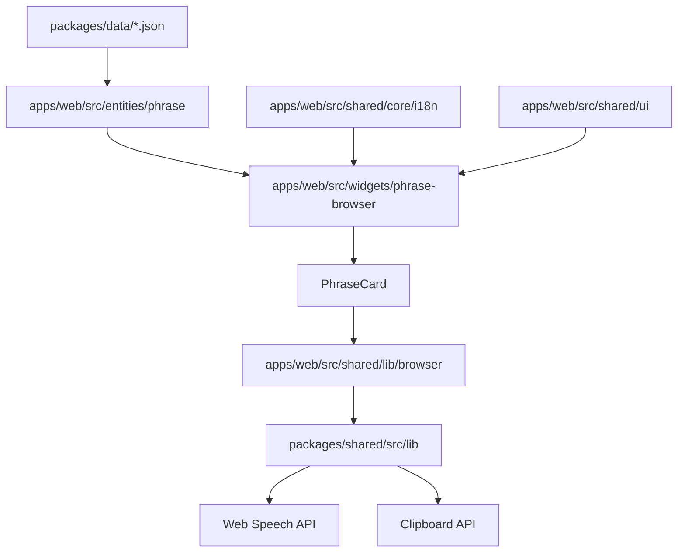

# Data Flow

Last verified: 2026-06-04

## Phrase Browser

## State Ownership

- `PhraseBrowser` owns selected pack, search query, and large text mode.
- `filterPhrases` is a pure local helper in the phrase browser widget.
- `PhraseCard` owns only per-card reply expansion state.
- Shared UI primitives are stateless wrappers around native elements.

## Copy And Content

- UI copy lives in `apps/web/src/shared/core/i18n/translations/en.json`.
- Phrase pack domain content stays in `packages/data/*.json`.
- Phrase interfaces are exported from `packages/shared/src/types` and re-exposed through the phrase entity public API.

## External APIs

- Web Speech API is guarded in `packages/shared/src/lib/speech.ts`.
- Clipboard API is guarded in `packages/shared/src/lib/clipboard.ts`.
- No backend API or TanStack Query usage exists yet.
