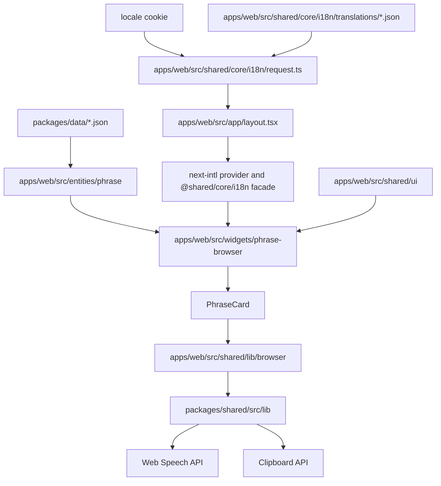
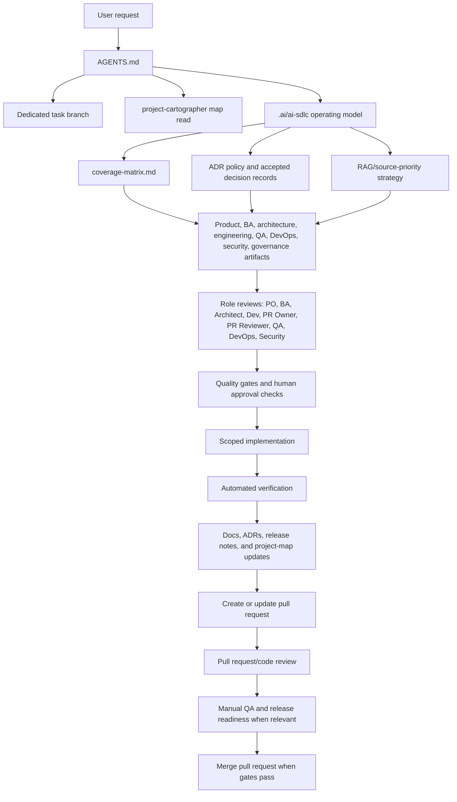
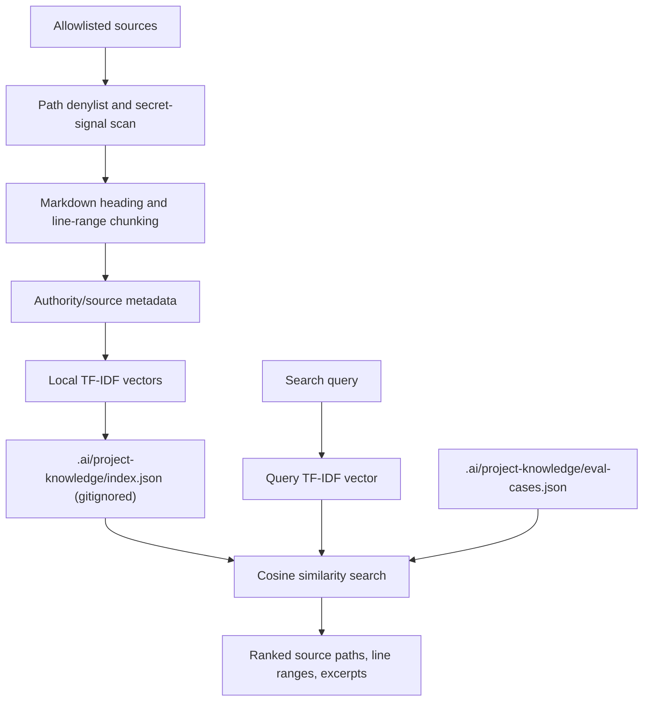

# Data Flow

Last verified: 2026-06-04

## Phrase Browser

## State Ownership

- `PhraseBrowser` owns selected pack, search query, and large text mode.
- `next-intl` owns request-scoped UI messages through the root layout provider.
- `useTranslation` is the local shared facade for `next-intl` and exposes the current locale plus a cookie-backed setter.
- `filterPhrases` is a pure local helper in the phrase browser widget.
- `PhraseCard` owns only per-card reply expansion state.
- Shared UI primitives are stateless wrappers around native elements.

## Copy And Content

- UI copy lives in `apps/web/src/shared/core/i18n/translations/en.json` and `apps/web/src/shared/core/i18n/translations/uk.json`.
- The default interface locale is Ukrainian (`uk`); English (`en`) is selectable in the phrase toolbar.
- Phrase pack domain content stays in `packages/data/*.json`.
- Phrase interfaces are exported from `packages/shared/src/types` and re-exposed through the phrase entity public API.

## External APIs

- Web Speech API is guarded in `packages/shared/src/lib/speech.ts`.
- Clipboard API is guarded in `packages/shared/src/lib/clipboard.ts`.
- No backend API or TanStack Query usage exists yet.

## AI SDLC Delivery Flow

- Small low-risk fixes can use the lightweight path documented in `.ai/ai-sdlc/README.md`.
- Every new task starts on a new dedicated `polite/` branch; existing branches are reused only for clear continuations of
  the same task or PR.
- Context retrieval follows `.ai/ai-sdlc/rag-strategy.md`; accepted ADRs in `.ai/ai-sdlc/adr/` constrain architecture
  decisions.
- Local project-knowledge retrieval can build a gitignored TF-IDF/cosine index from allowlisted docs, source, config, and
  project-map files, then search it with `npm run knowledge:search -- "query"`.
- High-risk work keeps the relevant role reviews, pull request creation, pull request review, merge readiness, artifacts,
  gates, QA strategy, security review, release readiness, rollback plan, and human approvals explicit.

## Local Project Knowledge Retrieval

- Implementation lives in `.ai/tools/project-knowledge`.
- User-facing/product RAG and external embedding/vector providers are not implemented.
- Any future external or product RAG path still requires ADR, evaluation, security/privacy review, rollback, and human
  approval gates.
